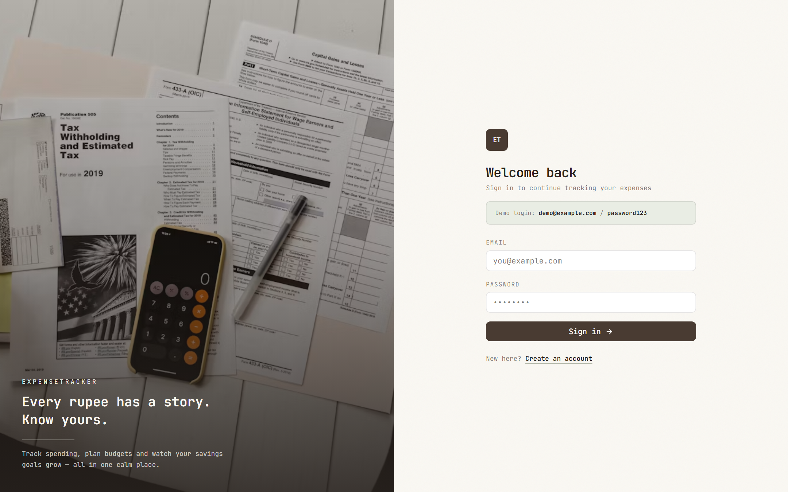
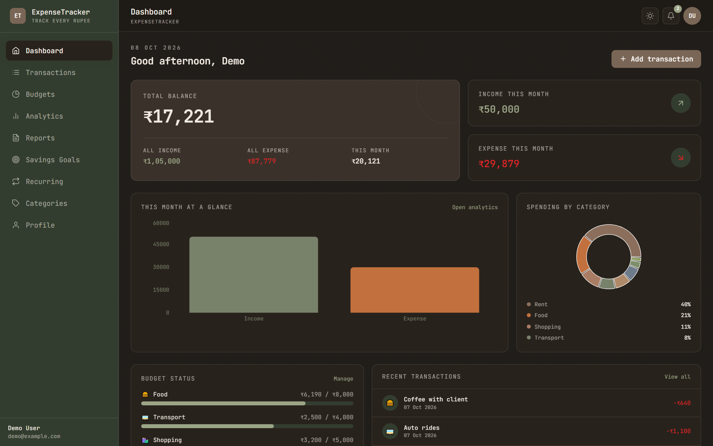
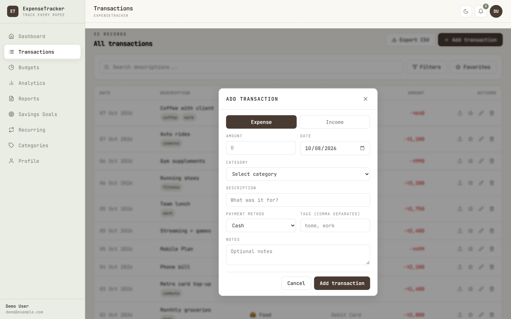
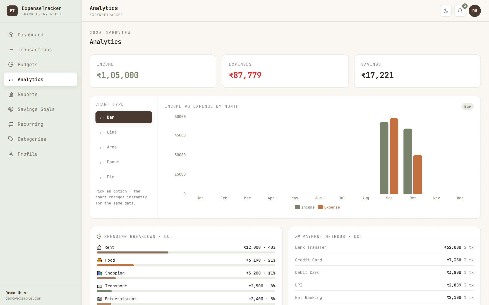
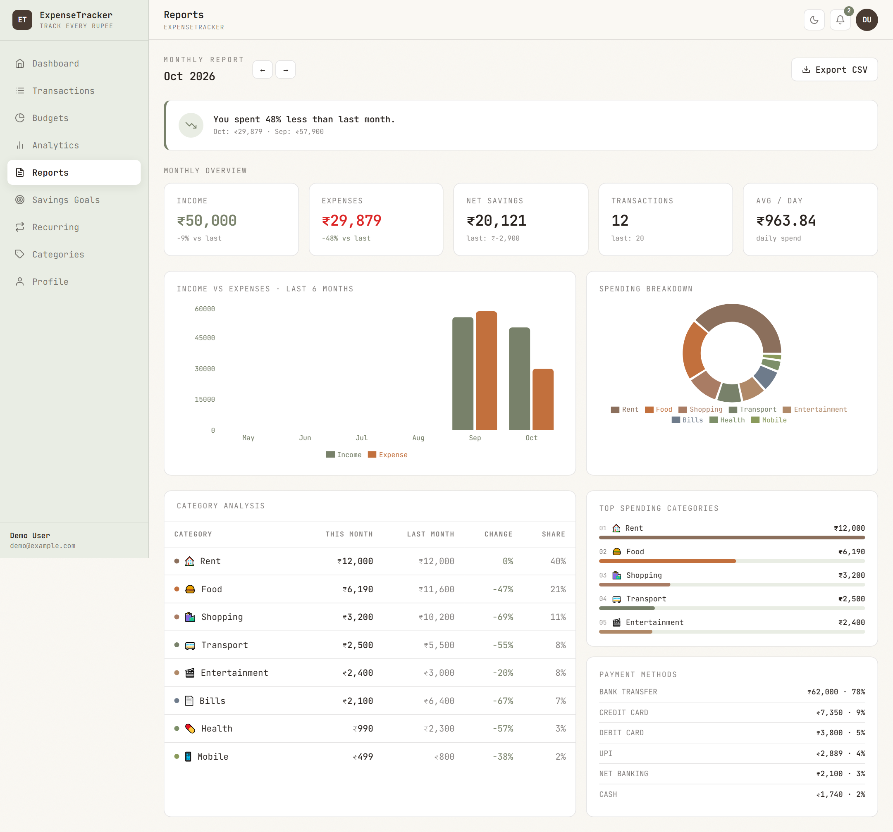
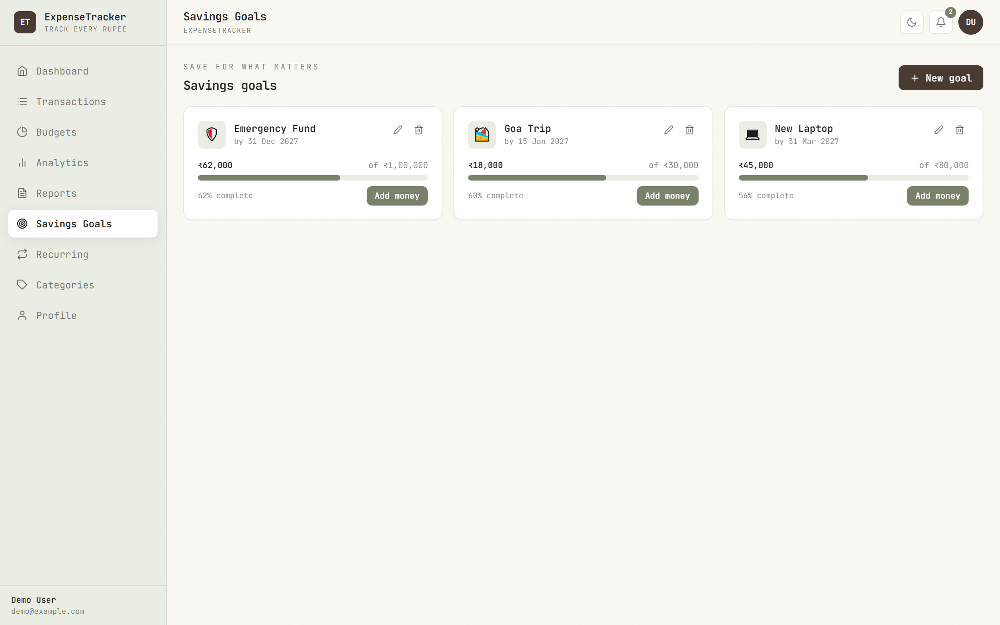
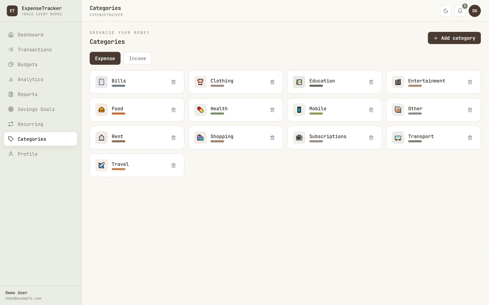

# ExpenseTracker

> A full-stack MERN personal expense & budget management system — record income and expenses, set monthly budgets, track savings goals, automate recurring payments, and understand spending with interactive charts and month-over-month reports.

[Report (HTML)](docs/ExpenseTracker-Mini-Project-Report.html) · [Report (PDF, 57 pages)](docs/ExpenseTracker-Mini-Project-Report.pdf) · [Screens](docs/images)

---

## Project Overview

ExpenseTracker is a complete, working personal-finance web application. A user signs up, records every income and expense, organises them into categories, sets a monthly limit per category, creates savings goals and recurring bills — and the application automatically reports where the money went.

| | |
|---|---|
| **Architecture** | 3-tier: React SPA ⇄ Express REST API ⇄ MongoDB |
| **REST endpoints** | 41 (38 behind JWT auth) |
| **Database** | MongoDB, 7 collections, compound indexes + aggregation pipelines |
| **Frontend** | 11 pages, 12 routes, 8 Redux slices, 8 colour themes + dark mode |
| **Testing** | 20/20 reported test cases passed (API + browser) |

**Module snapshot**

| Group | Modules |
|---|---|
| **Capture** | Authentication (JWT) · Transactions · Categories · Receipt upload · Favourites · Tags |
| **Control** | Monthly budgets · Budget notifications · Savings goals · Recurring expenses |
| **Insight** | Dashboard · Analytics (Bar / Line / Area / Pie / Donut) · Monthly reports · CSV export |
| **Platform** | REST API + security layer · Redux state · Theme engine · UX polish (skeletons, empty states, micro-interactions) |

### Why it exists

Manual tracking (diary / Excel) does not validate data, cannot warn before a budget breaks and cannot compare months automatically. ExpenseTracker solves this with a private, self-hosted app that runs entirely on a local machine — no third-party services, no ads, no subscription.

---

## Screenshots (category-wise)

### Authentication



### Dashboard (light + dark)




### Transactions




### Budgets


### Analytics & Charts




### Monthly Reports



### Savings Goals



### Recurring Expenses


### Categories



### Appearance & Themes


### UX States


---

## Features

**Authentication & profile**
- Register / login with JWT (7-day expiry), bcrypt-hashed passwords (10 rounds)
- Profile: display name, currency (INR/USD/EUR/GBP/JPY/CAD/AUD), monthly income target

**Transactions**
- Add / edit / delete income & expense records with category, date, payment method, tags, notes
- Debounced search, filters (date range, category, type, payment method, amount range, favourites), pagination
- Receipt upload (image only), favourite star, row-flash on insert, deep link `?new=1` opens the add modal

**Categories, budgets & goals**
- Custom categories with emoji icon + colour (19 defaults seeded, income/expense types)
- Per-category monthly budgets with progress bars and *On track / Near limit (≥80%) / Exceeded (≥100%)* status
- Savings goals with contributions, progress % and a milestone notification at 100%

**Recurring & notifications**
- Recurring plans (daily/weekly/monthly/yearly) with active/paused toggle that **auto-post** as transactions when due
- De-duplicated notifications (budget warning/exceeded, goal reached, recurring posted) in a bell dropdown

**Analytics, reports & export**
- Dashboard with balance hero, six-month chart, category donut, budget status, recent transactions
- Five switchable chart types (Bar / Line / Area / Pie / Donut) with no re-fetch
- Monthly report with month-over-month insight, KPI cards, category change % and top categories
- CSV export of any filtered list or selected month

**Design & UX**
- Option 8 — Warm White + Espresso + Sage default, JetBrains Mono typeface
- Light/dark mode + **8 selectable colour themes**, persisted in `localStorage`
- Loading skeletons, empty states, 150–300 ms micro-interactions, Escape-to-close modals, visible focus rings, `prefers-reduced-motion` support
- Amount sanitization on **both** client and server (digits, one dot, max 2 decimals, > 0)

---

## Tech Stack

| Layer | Technology |
|---|---|
| Frontend | React 18 (Vite 5), Redux Toolkit, React Router v6, Tailwind CSS 3.4, Recharts, Axios, react-hot-toast |
| Backend | Node.js, Express 4, Mongoose 8, JWT (`jsonwebtoken`), bcryptjs, Multer, helmet, CORS, morgan |
| Database | MongoDB (local, DB `expenseTracker`) |
| Tooling | Playwright (screenshots & report PDF), highlight.js (code figures) |

---

## Architecture

```
Browser (React SPA :5173)
   │  HTTP/JSON + Authorization: Bearer <JWT>
   ▼
Vite dev proxy  /api ──────────►  Express API (:5000)
                                  routes → protect → controllers → utils
   │                                      │
   │                                      ▼
   └── /uploads ◄── server/uploads    MongoDB (:27017)
                                       7 collections · indexes · aggregation
```

Request flow: **page → Redux thunk → Axios (token interceptor) → Express route → `protect` middleware → controller (validation) → Mongoose → MongoDB → `{ success, data }` envelope → slice state → UI**. On HTTP 401 the interceptor clears the token and redirects to `/login`.

---

## Project Structure

```
ExpenseTracker/
├── server/          # Express REST API
│   └── src/
│       ├── config/        env.js (only file reading process.env), db.js
│       ├── models/        7 Mongoose models
│       ├── middleware/    auth (JWT), error, upload (Multer)
│       ├── utils/         sanitize, processRecurring, notify, budgetStatus,
│       │                  buildCsv, defaultCategories
│       ├── controllers/   8 controllers
│       ├── routes/        8 routers → 40 endpoints (+ /api/health)
│       └── seed/seed.js   2 demo users + realistic data
├── client/          # React SPA (Vite)
│   └── src/
│       ├── config/        env.js (only file reading import.meta.env)
│       ├── themes/        8 theme files + registry
│       ├── features/      8 Redux slices + store
│       ├── services/api.js  Axios instance + interceptors
│       ├── components/    Modal, EmptyState, Loader, ProgressBar, charts, layout
│       ├── pages/         11 pages
│       └── utils/         amount.js, format.js, constants.js
├── doc/             # earlier draft report + raw screenshots
└── docs/            # formal project report (HTML/PDF) + images
```

---

## Getting Started

**Prerequisites:** Node.js ≥ 18 and MongoDB running locally on port 27017.

```bash
# Backend
cd server
npm install
cp .env.example .env
npm run seed      # creates 2 demo users with data
npm run dev       # http://localhost:5000

# Frontend (new terminal)
cd client
npm install
npm run dev       # http://localhost:5173
```

### Demo logins

| Email | Password | Data |
|---|---|---|
| `demo@example.com` | `password123` | 32 transactions, 5 budgets, 5 recurring, 3 goals |
| `saurabh@gmail.com` | `saurabh123` | 20 transactions, 3 budgets, 3 recurring, 3 goals |

---

## Documentation

- **Formal project report:** [`docs/ExpenseTracker-Mini-Project-Report.pdf`](docs/ExpenseTracker-Mini-Project-Report.pdf) (57 pages) — GTU-style cover, certificate, declaration, acknowledgement, abstract, project overview, table of contents with page numbers, index of figures, 15 chapters, use-case / architecture / context & Level-1 DFD / flowchart / ER diagrams, 15 category-wise screenshots, 7 annotated code figures, 20 test cases, references and three appendices. Source: [`docs/ExpenseTracker-Mini-Project-Report.html`](docs/ExpenseTracker-Mini-Project-Report.html).
- **Rebuild the report:** `npm run report` — renumbers all 28 figures, refreshes the Index of Figures, fills the table-of-contents page numbers and regenerates the PDF.
- **Raw assets:** [`docs/images/`](docs/images) (screens + code figures + logos).
- **Earlier draft:** [`doc/ExpenseTracker-Final-Report.html`](doc/ExpenseTracker-Final-Report.html).
